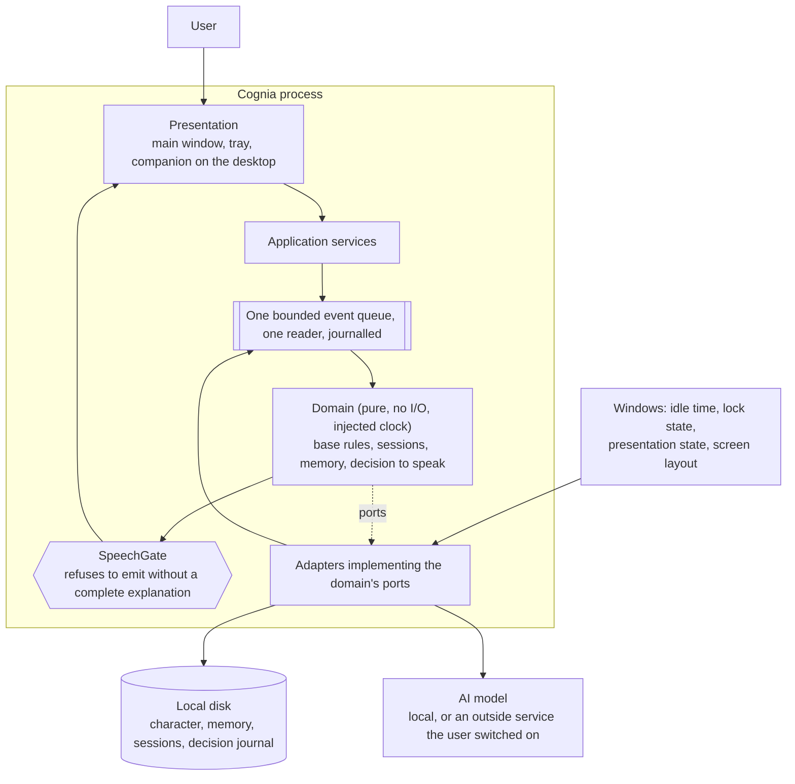

# Cognia

A desktop companion for people who work alone at a computer: a character that sits
on your screen, keeps you company through a work session, remembers the sessions
you have shared, and keeps every one of those memories on your own disk.

[](LICENSE)

## Status and ownership

| | |
|---|---|
| **Maturity** | Pre-alpha. The specification is written; no application code exists in this repository yet |
| **Owning team** | Single author — Nguyễn Duy Vũ |
| **Contact** | nguyenvu04.work@gmail.com |
| **On-call** | None. Cognia runs on one user's own machine; there is no hosted service to be on call for |
| **Source of record** | https://github.com/NguyenVu04/cognia |
| **Issue tracker** | https://github.com/NguyenVu04/cognia/issues |

> [!NOTE]
> This repository currently holds documents, not software. The specification
> ([`docs/USECASE_SPECIFICATION.html`](docs/USECASE_SPECIFICATION.html), COG-UCS-001
> version 3.0) is a **draft** awaiting approval by the supervising lecturer and the
> review panel. Anything below that describes behaviour describes *specified*
> behaviour. Nothing has been built, measured, or verified.

## Contents

- [Overview](#overview)
- [Architecture](#architecture)
- [Getting started](#getting-started)
- [Configuration](#configuration)
- [Usage](#usage)
- [Development](#development)
- [Testing and verification](#testing-and-verification)
- [Observability](#observability)
- [Security](#security)
- [Compliance and data handling](#compliance-and-data-handling)
- [Versioning and compatibility](#versioning-and-compatibility)
- [Governance](#governance)
- [Roadmap](#roadmap)
- [Contributing](#contributing)

## Overview

People who work alone at a computer for long stretches — a thesis, a freelance
contract, a remote job — spend most of the working day with nobody present. Nobody
asks what they are starting and nobody is there when they stop. The tools that claim
to help are aimed at a different problem: task managers organise work that is already
decided, and chat assistants answer a question and then forget you, with no idea what
time it is or whether you are even at your desk.

Cognia is a character drawn on your desktop rather than hidden behind a tray icon. It
stays still unless it has something to say. You give it a name and a role, or write
your own from scratch. It keeps you company through a work session: you say in one
line what you are about to do, it stays quiet while you do it, and it asks one
question at the end. It runs on your machine, so it knows the real time of day and
whether you are actually at the desk — and everything it knows about you is written
to your own disk, where you can read it, correct it, and delete it.

It is used by one person, on one Windows machine, through the ordinary working day.
It speaks at most three times a day by default, never between 22:00 and 07:00, and
neither speaks nor moves in the middle of your typing.

### The three pillars

| Pillar | What it means |
|---|---|
| **Character** | The companion has a name, a role, an appearance, and a history with you. It is not a tone setting on a chat box |
| **Continuity** | It remembers the sessions you have shared, so it is not amnesiac. It is not a note-taking service |
| **Presence** | It is on the screen while you work, rather than sending you notifications |

### Capabilities

- **Choose or write a character** — pick one of four ready-made characters, or
  describe your own in plain words and hear it answer immediately. Earlier versions
  are kept, so a rewrite can be undone (UC-01 to UC-03).
- **Work sessions** — open a session with a one-line intent, work in silence, close
  it with a single question. The session record is what continuity is built from
  (UC-05, UC-07).
- **Desk awareness, off until switched on** — idle time, lock state and presentation
  state, and nothing else. It is what lets the companion offer a break and greet a
  return without asking (UC-04, UC-06, UC-08).
- **Readable, correctable memory** — everything remembered is shown in two groups,
  what you said and what the companion noticed, with the evidence behind every
  noticed item. Any item can be corrected or removed; everything can be erased
  (UC-12 to UC-14).
- **An explanation for every proactive message** — the real figures the decision was
  made from: what was observed, which threshold was crossed, what delayed it, how
  much of the daily allowance is spent (UC-17).
- **A visible companion that makes no demands** — drag it, hide it, bring it back. It
  never takes the keyboard focus, never reacts to being ignored, and is never the
  only route to any function (UC-20).
- **One click to stop everything** — pause takes the companion off the screen and
  stops all observation and all messages (UC-15).

### The seven base rules

These bind every use case, and no character can override them.

| | |
|---|---|
| **BR-01 Speak sparingly** | At most 3 proactive messages a day, adjustable. Once spent, silence |
| **BR-02 Quiet hours** | Nothing between 22:00 and 07:00, nor while locked, nor while presenting full-screen |
| **BR-03 Wait for a pause** | Continuous typing is never interrupted |
| **BR-04 No clinging** | No streaks, no "we miss you", no message whose purpose is to bring the user back |
| **BR-05 In-session silence** | While a session is open, nothing is sent except the break nudge |
| **BR-06 Honest wording** | "At the machine for 90 minutes", never "working for 90 minutes". With no evidence, it says nothing |
| **BR-07 Motion is speech** | Any movement directed at the user is governed and counted exactly as a spoken message is |

### Non-goals

Section 5 of the specification lists these as **deliberately never**, not as work
deferred:

- **Task and reminder management, and precise-time alarms** — Todoist and Outlook own
  that category, and BR-02 and BR-03 both forbid firing on an exact second. Anything
  ruined by being missed belongs on a phone.
- **Reading email, calendar integration, acting on the user's behalf** — a companion
  at your desk is not an agent running errands, and every integration breaks the
  local-only claim.
- **Reading which application or window is open** — tempting for desk presence, but
  asking one question gives better information at no privacy cost. This also rules
  out the genre's defaults: walking along window edges, avoiding the window being
  typed in, sitting on the taskbar.
- **A companion with needs, moods that decay, or anything to be looked after** — a
  companion that looks neglected is asking to be attended to, which is BR-04's
  "we miss you" in a different medium.
- **Synchronising across devices, sharing, more than one user per machine** — one
  person, one machine. A second person is a different privacy problem.

Two exclusions are resourcing decisions rather than positioning ones, and may change:
**generating an appearance** (appearances are chosen from ready-made sets), and
**macOS and Linux builds** (Windows 10 and 11 are being finished first).

## Architecture

The shape below is decided in
[ADR 0001](docs/adr/0001-layered-architecture-with-event-driven-core.md) and is
independent of the framework, which has not been chosen. Dependencies point inward
only; an import in the reverse direction fails the build.



### Components

No source tree exists yet, so these are the parts ADR 0001 commits to rather than
directories you can open.

| Component | Responsibility | Status |
|---|---|---|
| Presentation | Main window, tray icon, and the companion drawn on the desktop. Never takes the keyboard focus, and is never the only route to a function (FR-25, FR-28) | Not created |
| Application services | Turns what the user does into events, and domain decisions into things on screen | Not created |
| Domain | The seven base rules, session state, memory, and every decision to speak. No I/O, no ambient clock — given the same journal it produces the same decisions (NFR-14) | Not created |
| `SpeechGate` | The single exit for every proactive message, including anything shown rather than said. Assembles the explanation NFR-10 requires and refuses to emit without one | Not created |
| Ports | Interfaces the domain declares by capability — replying in character, whether the user is at the desk, the current time, storage, showing something. The presence port carries exactly the three facts C-05 permits, so no code can ask for a fourth | Not created |
| Adapters | Implement the ports against Windows, the AI model, and the disk | Not created |
| Decision journal | Append-only: what was observed, which threshold was crossed, what delayed the message, how much of the allowance was spent. UC-17 reads it; NFR-14 replays it | Not created |

### External dependencies

| Dependency | Purpose | Criticality | Owner |
|---|---|---|---|
| Windows 10 / 11 | Supplies exactly three facts about the user — idle time, lock state, presentation state — plus the screen layout needed to draw the companion. Nothing else may be read (C-05) | Degraded — desk awareness is off until switched on, and everything else works without it | Microsoft |
| AI model, running locally | Generates the companion's replies | Degraded — with the model stopped, session timing, the break nudge, the memory list and pause all keep working (NFR-09) | Not yet chosen |
| An outside AI service | Optional replacement for the local model, off unless the user switches it on. Every send is warned about beforehand and recorded (NFR-02) | Optional | Chosen by the user |

## Getting started

There is nothing to install. This repository contains the specification, the
architecture decision records, and the project documents — no application code, no
build, and no release.

### Prerequisites

| Requirement | Version | Notes |
|---|---|---|
| A web browser | Any | The specification is a single self-contained HTML file |
| Git | Any | Only if you want a local copy |

### Read it

```bash
git clone https://github.com/NguyenVu04/cognia.git
```

Then open `docs/USECASE_SPECIFICATION.html` in a browser. Start at section 3
(Overview) for what Cognia is, section 5 for what it will deliberately never do, and
section 10 for the twenty use cases.

### What the built application will require

Recorded here so the eventual prerequisites are not a surprise, from the constraints
in section 7 of the specification: Windows 10 or 11 (C-01), one user on one machine
with no account and no server (C-02), and an AI model on that machine — or an outside
service the user switches on themselves (C-03).

## Configuration

There are no environment variables, no configuration file, and no secrets, because
there is no application yet. Cognia will hold no credentials of its own: it has no
account, no server, and no usage reporting (NFR-01).

These are the settings the specification commits to, all of them set by the user in
the application and stored on their own disk:

| Setting | Default | Specified in |
|---|---|---|
| Character — name, role, appearance, manner of speaking | None. No character is chosen for the user | FR-01 to FR-04, UC-01 to UC-03 |
| Desk awareness | Off until the user switches it on, after being told plainly what is read and what is not | FR-06, UC-04 |
| How often the companion speaks up | At most 3 proactive messages a day | BR-01, FR-22, UC-18 |
| Quiet hours | 22:00 to 07:00, plus whenever the machine is locked or presenting full-screen | BR-02, UC-18 |
| Each kind of proactive message | Individually switchable, on | FR-22, UC-18 |
| Break threshold | Set by the user; the nudge is offered only at a pause in typing | FR-09, UC-06 |
| Outside AI service | Off. Switching it on shows a warning first, and every send afterwards is recorded | NFR-02, C-03 |

## Usage

Nothing runs yet. This is what the core interaction is specified to be — the shape
the phase 2 build is measured against.

**Opening a session** (UC-05). The user says in one line what they are about to do,
from the main window or the tray. The companion records the intent and the start
time, says nothing further, and stays still on the desktop until the session closes.
The break nudge is the only exception (BR-05).

**Closing it** (UC-07). The companion asks one question about how it went. It records
the intent, the start, the end, the time at the machine, and the answer — and nothing
inferred beyond them.

**Asking why it spoke** (UC-17). Any proactive message can be interrogated, and the
answer is the real figures the decision was made from, not a description of the
feature. A message whose explanation cannot be assembled is never sent at all
(NFR-10).

There is no API and no reference documentation to link. Cognia is one person's
desktop application, not a service with callers.

## Development

### Layout

```
cognia/
├── docs/
│   ├── USECASE_SPECIFICATION.html   the specification, COG-UCS-001 v3.0
│   ├── adr/                         architecture decision records
│   ├── CONTRIBUTING.md              how to work on this repository
│   ├── SECURITY.md                  how to report a vulnerability
│   └── CHANGELOG.md                 release history
├── CLAUDE.md                        working agreement for AI assistance
├── LICENSE                          MIT
└── README.md                        this file
```

There is no source directory. When there is one, it will be laid out along the four
layers in ADR 0001, and the layering will be enforced by a build check rather than by
discipline.

### Standards

| | |
|---|---|
| **Style and lint** | Not yet decided — no language or framework has been chosen (ADR 0001) |
| **Commits** | Not yet decided |
| **Branching** | Trunk-based on `main`, single author |
| **Review** | See [docs/CONTRIBUTING.md](docs/CONTRIBUTING.md) |
| **Architecturally significant changes** | An ADR before implementation. See [docs/adr/README.md](docs/adr/README.md) |

### Local loop

There is no lint command and no test command, because there is nothing to lint or
test. The only check that applies today is that the specification, the ADRs and this
file agree with each other.

## Testing and verification

Cognia's requirements are promises about behaviour rather than features in one place,
so the specification names a verification method for each rather than a test tier.
Every row below is **not started**, and the full traceability matrix is section 11 of
the specification.

| What is verified | How | Requirement |
|---|---|---|
| Nothing leaves the machine | Network capture across a full week of ordinary use; zero outbound connections the user did not enable | NFR-01, G-05 |
| No keystrokes, screenshots, clipboard, browsing history, or window contents are read | Code review plus a system-call audit, each release | NFR-03, C-05 |
| No proactive message escapes without a complete explanation | Automated check in the build — it refuses rather than warns — plus inspection of the message log | NFR-10 |
| Every decision to speak replays identically | Replay run over the recorded journal, compared against the original decision log | NFR-14 |
| The application survives the model failing | Run with the model deliberately disabled; session timing, break nudge, memory list and pause must all still work | NFR-09 |
| Nothing recorded is lost on an abrupt shutdown | 20 forced power-offs | NFR-08 |
| Every data category is visible, correctable and erasable | Walk every category through UC-12, UC-13 and UC-14, then inspect the disk | NFR-04 |
| The companion is never the only route to anything | A keyboard-only walkthrough of every use case, run once with the companion hidden, plus a contrast audit against WCAG 2.2 AA | NFR-12, FR-28 |
| Safety behaviour cannot be written away by a character | Scripted mental-health cases run under every character, reviewed by a person, each release | NFR-13, FR-04 |
| The resource cost of running all day | Resource monitoring across an 8-hour idle run, once with the companion hidden and once with it on screen | NFR-05 to NFR-07 |

> [!IMPORTANT]
> The figures in NFR-05, NFR-06 and NFR-07 are targets, not measurements, and the
> two figures for a companion on screen are the least founded of them. They are to be
> measured and the specification updated before it is approved.

## Observability

Cognia sends no telemetry, has no dashboards, and reports no usage anywhere — that is
NFR-01, and it is the point of the product rather than an omission. What replaces
them is local and readable by the person the data is about:

| Signal | Where | Read by |
|---|---|---|
| Decision journal — what was observed, which threshold was crossed, what delayed a message, how much of the daily allowance was spent | Append-only, on the user's disk | The user, through UC-17; the developer, through the NFR-14 replay |
| Outside-service send log — time and destination of every send, if the user switched an outside AI service on | On the user's disk | The user (NFR-02) |
| Memory — what the user said, and what the companion noticed with the evidence behind it | On the user's disk | The user, through UC-12 |

The journal records observations about the user, so it is personal data under NFR-04
and is reachable by UC-12, UC-13 and UC-14. Being an implementation detail does not
exempt it.

## Security

To report a vulnerability, see [docs/SECURITY.md](docs/SECURITY.md). **Do not open a
public issue for a security problem.**

| | |
|---|---|
| **Authentication** | None. There is no account and no server (C-02) |
| **Authorization** | One user, who holds every permission the system has |
| **Transport** | No outbound connection at all unless the user switches on an outside AI service (C-03, NFR-01) |
| **Secrets** | Cognia holds none of its own. If the user configures an outside service, its credential is theirs and stays on their machine |
| **Data at rest** | On the user's own disk. The specification does not commit to encrypting it, and no such claim should be read into this document |
| **Dependency scanning** | Not yet set up — there are no dependencies yet |
| **Static analysis** | Not yet set up |
| **Data classification** | The repository and this specification are public. The user's own data is personal, local, and never transmitted |

The largest security property is structural: the exclusions in section 5 are enforced
by absence. There is no mail port, so there is no way to read mail. Plugins were
considered and rejected in ADR 0001 for the same reason — a character that can arrive
with code attached makes "no character can switch this off" untrue.

Known accepted risks: the personal data on disk is protected by the operating
system's own account boundary and nothing further. This follows from C-02, one user
per machine.

## Compliance and data handling

| | |
|---|---|
| **Regimes** | None applies to the author. Cognia collects nothing, transmits nothing, and no data ever reaches the developer or any third party. The user is the only party in possession of their data |
| **Data categories** | What the user says about themselves; session records (intent, start, end, time at the machine, closing answer); observations the companion derived, each with the evidence behind it; the character and its earlier versions; the decision journal |
| **Lawful basis** | Not applicable — there is no processor and no controller other than the user themselves |
| **Retention** | Held until the user deletes it. Any single item is removable (UC-13); memory can be erased while keeping the character, or everything erased (UC-14) |
| **Residency** | The user's own disk. There is no second copy anywhere (NFR-04) |
| **Sub-processors** | None, unless the user switches on an outside AI service — in which case that service is theirs, chosen by them, warned about beforehand, and every send is recorded (NFR-02) |
| **Subject access / erasure** | UC-12 shows everything held, in two groups with the evidence behind every derived item; UC-13 corrects or removes one item; UC-14 erases in full. Target: any item reachable in 2 clicks and deletable in 2 more (G-04) |
| **Audit logging** | The local decision journal, kept on the user's disk and erasable by them like anything else |

Not written yet: a data protection assessment. None is planned, because no personal
data is processed by anyone other than the user on their own machine — if that reading
is wrong, it is the reading a reviewer should challenge first.

## Versioning and compatibility

This project follows [Semantic Versioning](https://semver.org/spec/v2.0.0.html).

**No version has been released.** There is no public API, no package, and no build
artifact. Until 0.1.0 exists, the only versioned things in this repository are the
documents, and they carry their own version numbers — the specification is at 3.0,
recorded in its section 1.1.

**When there is a release, the version contract will cover** the on-disk data format,
because it is the user's own data and an upgrade must not lose it. Everything else —
internal layering, port shapes, the decision journal's internal structure — may change
in any release.

| Version line | Status | Supported until |
|---|---|---|
| Unreleased | No release exists | — |

Deprecations, once there is anything to deprecate, are announced before removal,
marked in code, and listed in [docs/CHANGELOG.md](docs/CHANGELOG.md).

### Reproducibility and lineage

NFR-14 requires that the developer can replay every decision to speak on recorded data
and get the same result, so that two decision strategies can be compared fairly.
ADR 0001 makes this a property of the structure rather than a feature: a pure domain
fed an ordered journal replays by construction.

| Layer | Versioned by | Answers |
|---|---|---|
| Code and configuration | Git | By what procedure was this produced? |
| Recorded input | The append-only decision journal on the user's disk | Which exact observations, thresholds and timings? |
| Runs and results | The decision log, compared against a replay run | What was decided, and would the same input decide it again? |

There is no reproduce command yet, because there is no build. Retention of the
journal is the user's decision — it is erasable like anything else they own (UC-14).

## Governance

| | |
|---|---|
| **Code owners** | Nguyễn Duy Vũ. No `CODEOWNERS` file exists; there is one author |
| **Review requirement** | Single-author project. The academic approvals in section 1.2 of the specification — supervising lecturer and review panel — are the review that binds it, and both are still pending |
| **Merge policy** | Not yet decided |
| **Decision records** | [`docs/adr/`](docs/adr/) |

Architecturally significant changes need an ADR before implementation. See
[docs/adr/README.md](docs/adr/README.md) for what counts as significant.

## Roadmap

The delivery order is section 10.2 of the specification. The version that can be
demonstrated ends at phase 2. Every goal below targets **2026-12-15**, and every
target in it is a proposal awaiting the review that approves specification version 3.0.

| Phase | Use cases | What exists at the end of it | Status |
|---|---|---|---|
| **1** | UC-01, 02, 03, 09, 10, 12, 13, 14 | A character with a memory, usable every day. No presence yet — a chat window and a memory, nothing on the desktop | Not started |
| **2** | UC-04, 05, 06, 07, 08, 15, 17, 18, 20 | Work sessions, and the companion on the screen. This is the phase that makes the product what it is | Not started |
| **3** | UC-11, 16, 19 | Presence tuning, and the character evolving over time | Not started |

Open questions that block phase 1, both owned by the author and needed by 2026-09-15:
the four ready-made characters need names, stated roles and appearances; and the
artwork for those appearances needs a licence that permits redistribution, since this
repository is public and MIT-licensed.

## Contributing

Start with [docs/CONTRIBUTING.md](docs/CONTRIBUTING.md). Release history will be in
[docs/CHANGELOG.md](docs/CHANGELOG.md).

Cognia is a single-author academic project with a deliberately closed scope. Section 5
of the specification exists to close questions rather than leave them open, so a
proposal to add tasks, reminders, alarms, mail, calendars, cross-device sync, or a
companion that reacts to being ignored will be declined with a pointer to the row that
already covers it.

## License

MIT — see [LICENSE](LICENSE).
